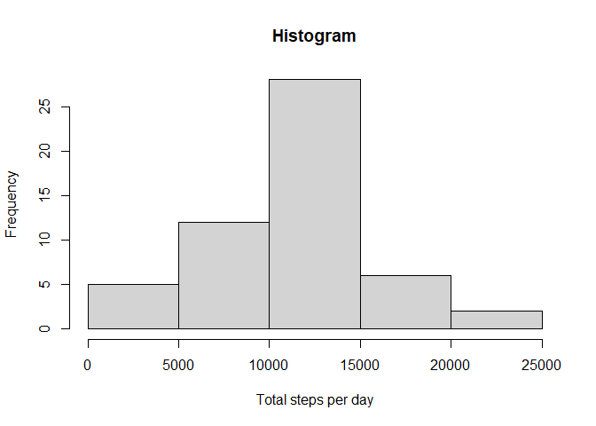
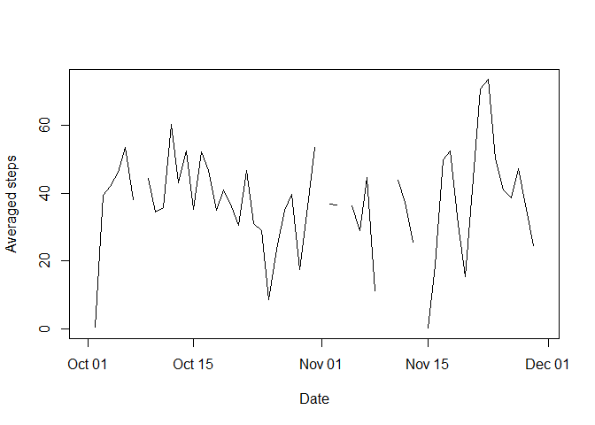
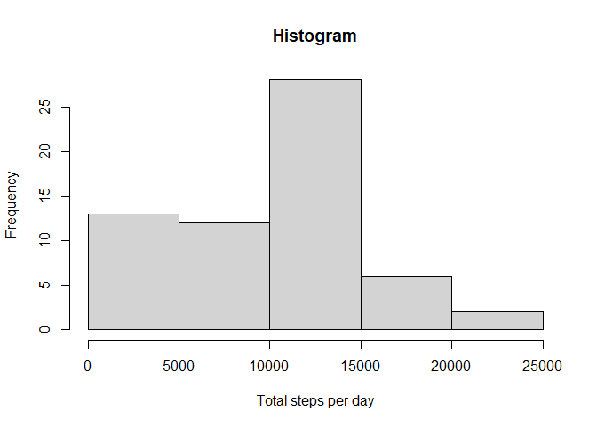
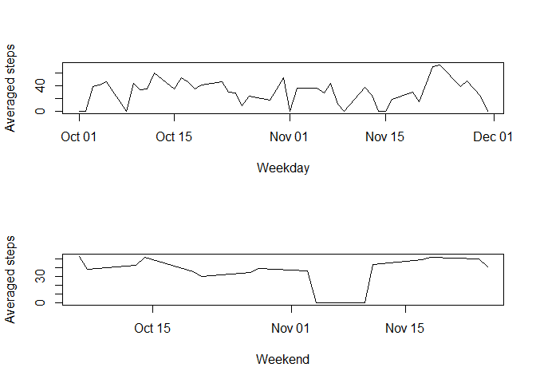

## Loading and preprocessing the data

```r
library("dplyr")
da <- read.csv('activity.csv')
da$date <- as.Date(da$date, "%Y-%m-%d")
head(da)
```

```
##   steps       date interval
## 1    NA 2012-10-01        0
## 2    NA 2012-10-01        5
## 3    NA 2012-10-01       10
## 4    NA 2012-10-01       15
## 5    NA 2012-10-01       20
## 6    NA 2012-10-01       25
```


## What is mean total number of steps taken per day?

```r
ra <- group_by(da, date)
ta <- summarise(ra, total=sum(steps))
hist(ta$total, xlab="Total steps per day", main="Histogram")
```

<!-- -->

```r
print(summary(ta$total))
```

```
##    Min. 1st Qu.  Median    Mean 3rd Qu.    Max.    NA's 
##      41    8841   10765   10766   13294   21194       8
```


## What is the average daily activity pattern?

```r
plot(ta$date, ta$total/12/24, type='l', xlab="Date", ylab="Averaged steps")
```

<!-- -->

```r
#Which 5-minute interval, on average across all the days in the dataset, 
#contains the maximum number of steps?
ta$date[which.max(ta$total)]
```

```
## [1] "2012-11-23"
```


## Imputing missing values

```r
#Calculate and report the total number of missing values in the dataset
sum(is.na(ra$steps))
```

```
## [1] 2304
```

```r
pa <- ra
#Replace the NA with 0
pa$steps[is.na(pa$steps)] <- 0
#Calculate the total steps per day after replace the NA with 0
pa <- group_by(pa, date)
qa <- summarise(pa, total=sum(steps))
hist(qa$total, xlab="Total steps per day", main="Histogram")
```

<!-- -->

```r
print(summary(qa$total))
```

```
##    Min. 1st Qu.  Median    Mean 3rd Qu.    Max. 
##       0    6778   10395    9354   12811   21194
```


## Are there differences in activity patterns between weekdays and weekends?

```r
#Create a new factor variable in the dataset with two levels 
#– “weekday” and “weekend” indicating whether a given date 
#is a weekday or weekend day
qa$day <- factor(weekdays(qa$date) == "Saturday" | 
                   weekdays(qa$date) == "Sunday", 
                 levels=c(FALSE, TRUE), labels=c("weekday", "weekend"))
head(qa)
```

```
## # A tibble: 6 x 3
##   date       total day    
##   <date>     <dbl> <fct>  
## 1 2012-10-01     0 weekday
## 2 2012-10-02   126 weekday
## 3 2012-10-03 11352 weekday
## 4 2012-10-04 12116 weekday
## 5 2012-10-05 13294 weekday
## 6 2012-10-06 15420 weekend
```

```r
#Make a panel plot containing a time series plot of the 5-minute interval
#(x-axis) and the average number of steps taken, 
#averaged across all weekday days or weekend days (y-axis).
par(mfrow=c(2,1))
s1 <- subset(qa, as.integer(qa$day) == 1)
s2 <- subset(qa, as.integer(qa$day) == 2)

plot(s1$date, s1$total/12/24, type='l', xlab="Weekday", ylab="Averaged steps")
plot(s2$date, s2$total/12/24, type='l', xlab="Weekend", ylab="Averaged steps")
```

<!-- -->
